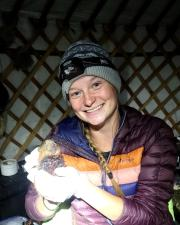
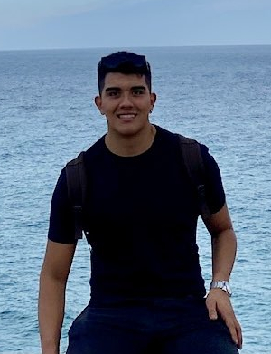
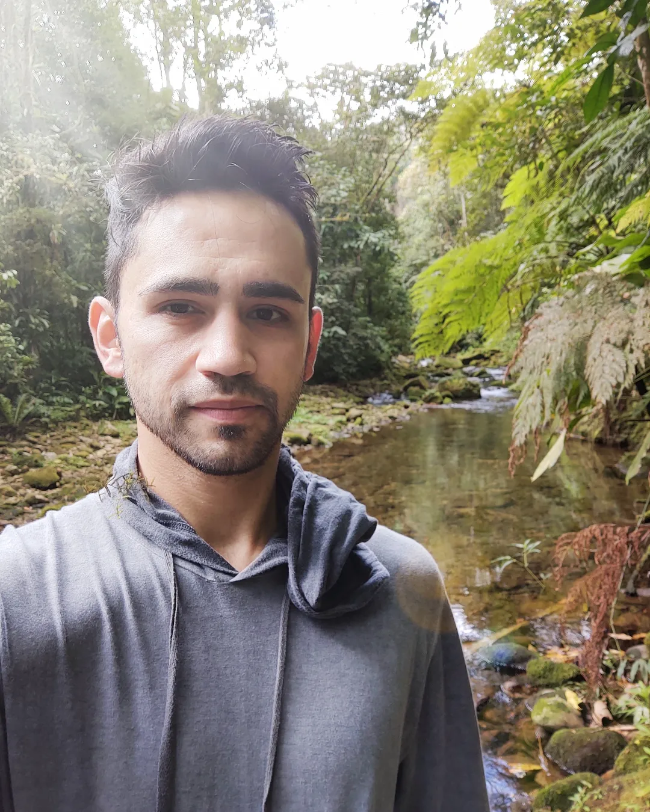
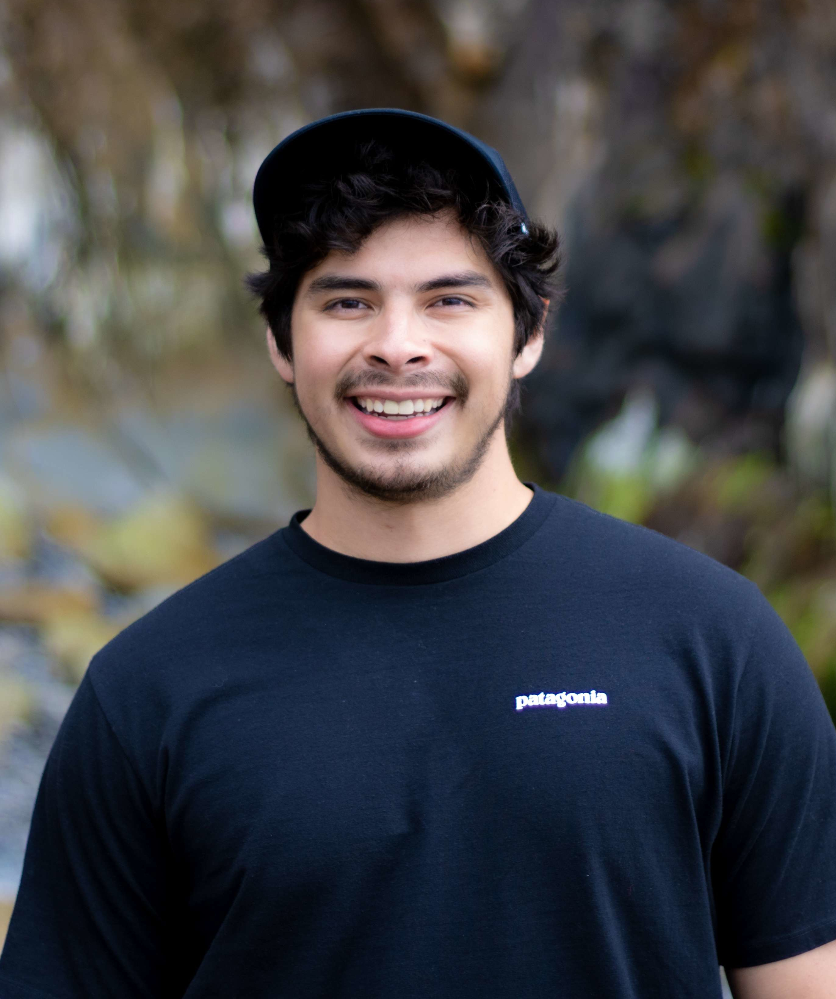
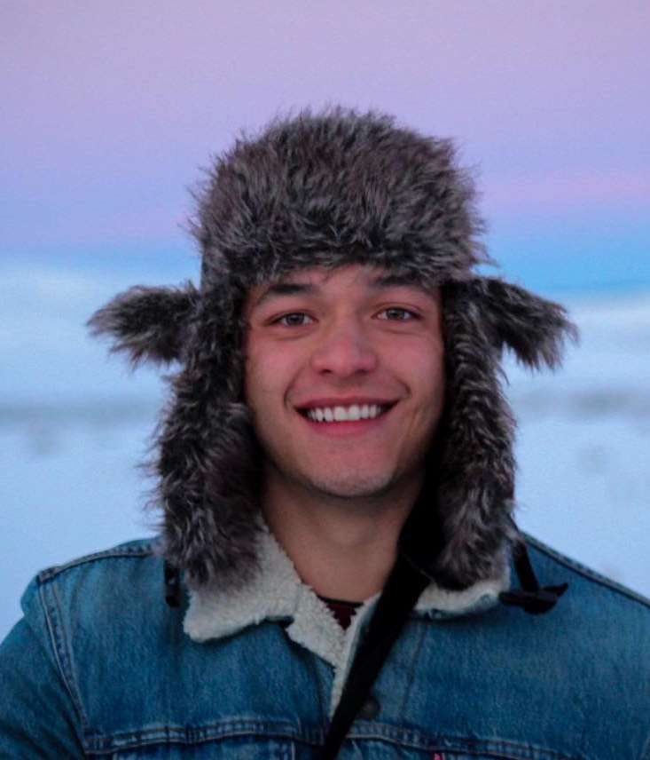
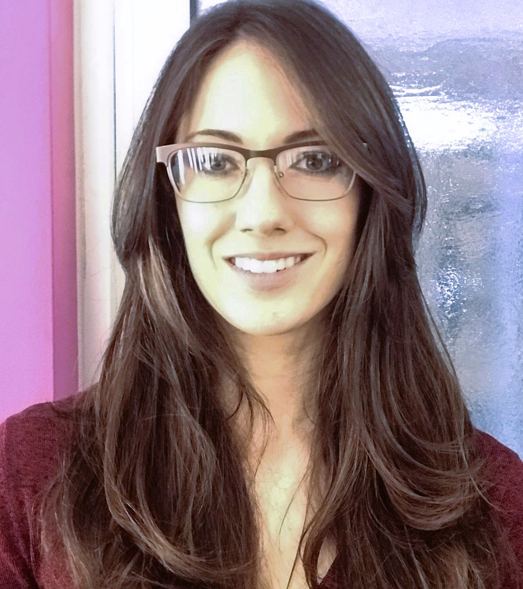
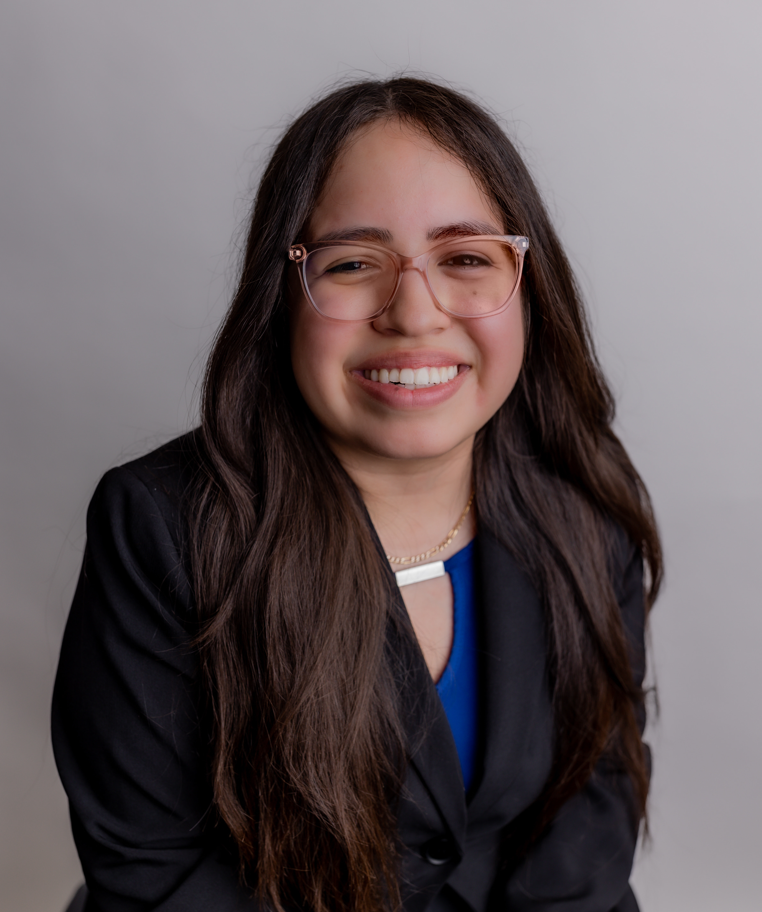
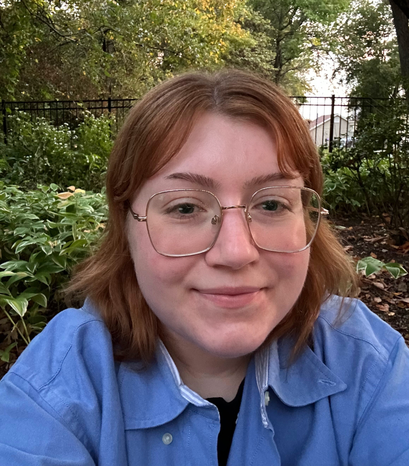
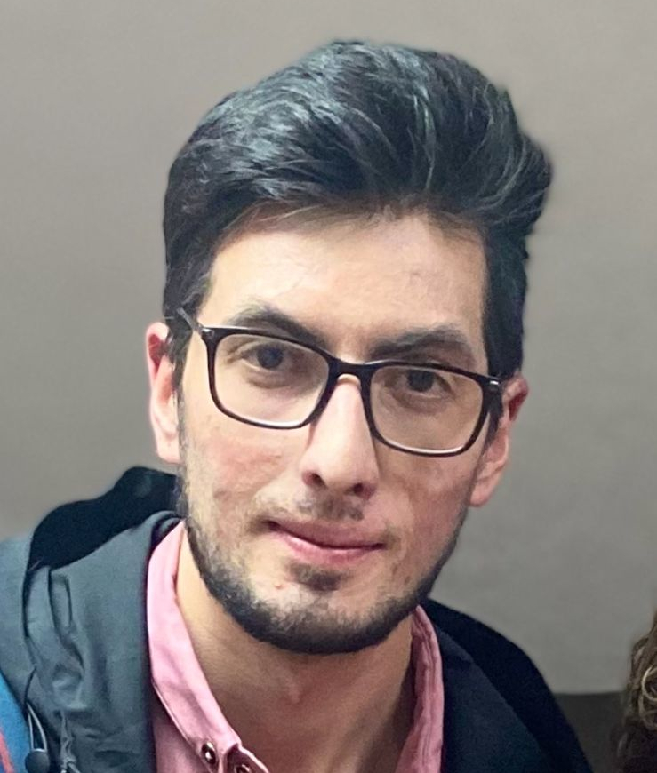
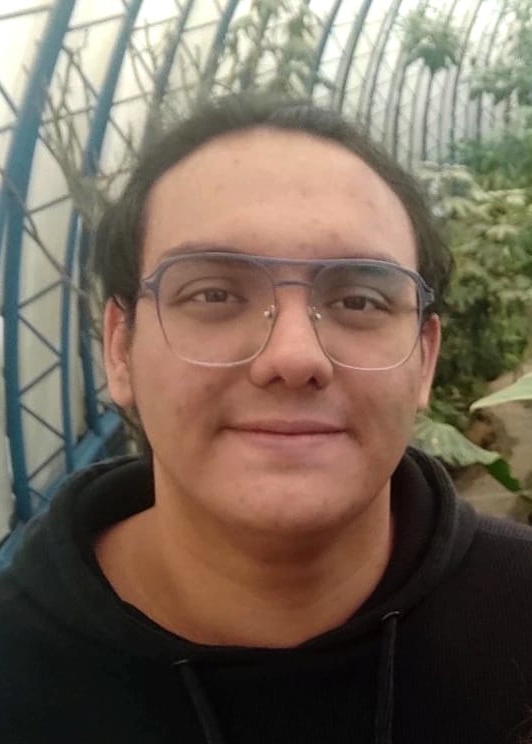

---
authors:
- admin
categories:
- Mentoring
date: "2023-09-20T00:00:00Z"
draft: false
featured: true
lastmod: "2024-04-07T00:00:00Z"
projects: []
subtitle: "We Learn Together"
summary: "A description of my mentoring experience."
tags:
- Mentoring
- Students
- Learning
title: 
  "Mentoring"
---

Mentoring is a truly fulfilling experience for me. As a early career scientist, I find immense joy in guiding and motivating the next generation of researchers. Through mentoring, I get to share not only my expertise but also the valuable lessons I have learned throughout my own journey. It is an opportunity to nurture students passion and curiosity, helping them grow into confident new scientist. It is more that me teaching them, they teach me new things every day. 
{style="text-align: justify;"}

Below I list graduate and undergraduate students that have developed research projects under my mentorship.
{style="text-align: justify;"}

 

## Graduate mentees

|**Danielle M. Land**|||
|---|---|---|
|||Danielle graduated and did her master's at University of New Mexico. She is currently a Ph.D. student at the University of Kansas. I have been mentoring Danielle on a project focused on understanding Asian Biogeography using shrews as a model. Danielle is using a set of tools, including ecological niche modeling, to explore current and past landscapes of suitability for shrews as a way to understand historical processes that shaped the biodiversity patterns that are observed nowadays. Other collaborators in these projects include Joe Cook and Jocelyn Colella.|

 

|**Mackenzie Grover**|||
|---|---|---|
|||Kenzie graduated from University of Wisconsin - Stevens Point, and did her master's at Northern Michigan University. She is currently a Ph.D. student at the University of Kansas. Kenzie's project goal is to identify strategies to improve models to characterize ecological requirements and distributions of parasites. Her project aims to define protocols that allow better integration of natural history and ecological considerations when modeling parasite niches and distributions. Other collaborators in these projects include Kurt Galbreath and Jocelyn Colella.|

 

|**Luis F. Arias-Giraldo**|||
|---|---|---|
|||Luis Felipe graduated from Universidad de Córdoba, and did his master's at Universidad de Valecia in Spain. He is currently a Ph.D. student at the Spanish National Research Council. Luis Felipe visited KU and since then I have been mentoring him on a project focused on developing innovative methods and statistical tools for comprehensive ecological niche modeling using presence absence records. The methods and tools developed are generally applicable and will be soon available as a new R package, `enmpa`. An application of these methods lead by Luis is focused geographically in Andalusia, Spain, where he is modeling risks derived from the fungus *Verticillium dahliae* to Olive and Cotton plantations. Other collaborators in these projects include Blanca Landa, Juan Navas-Cortés, and Town Peterson.|

 

|**Weverton Trindade**|||
|---|---|---|
|||Weverton graduated from Universidade de Coimbra, and did his master's at Universidade Estadual de Ponta Grossa in Brazil. He recently obtained his Ph.D. at Universidade Federal do Paraná. Weverton is now a postdoc at at Universidade Federal do Paraná and we keep collaborating. We met when Weverton came to KU as a research visitor and started working on an independent project focused on improving model selection routines for ecological niche modeling. The routines Weverton is developing can be applied to studies using ENM methods for a more robust selection of model parameters. These tools will available soon as part of a new version of the R package `kuenm`. Other collaborators in these projects include Luis Osorio-Olvera, Jorge Soberón, and Town Peterson.|

 

|**Abby Perkins**|||
|---|---|---|
|||Abby graduated from the University of Kansas. She is currently in the Peterson lab doing her Master's in the EEB Department at KU. Abby is working on a project exploring new alternatives to deal with spatial autocorrelation in ecological niche modeling. Her work will be implemented in new routines for ENM calibration to help researchers control the effect of sampling biases in models. Other collaborators in this project include Weverton Trindade and Town Peterson.|

 

|**Daniel Ibañez IV**|||
|---|---|---|
|||Danny graduated from New Mexico State University. Currently, part of the Colella lab, Danny is doing his Master's in the EEB Department at the University of Kansas. His project focuses on developing time-specific ecological niche models for the species *Zygodontomys brevicauda*. Danny's project is part of a bigger effort aiming to understand the dynamics of hantavirus prevalence in host populations in Panama. Other collaborators in this project include Alex Hey, Joe Cook, and Jocelyn Colella.|

 

|**Alexander Hey**|||
|---|---|---|
|||Alex graduated from Colorado State University. He is also part of the Colella lab, doing his Master's in the EEB Department at the University of Kansas. His project focuses on developing time-specific ecological niche models for the species *Oligoryzomys costaricensis*. Alex's project is also part of a long-term effort aiming to understand the dynamics of hantavirus prevalence in host populations in Panama. Other collaborators in this project include Danny Ibañez, Joe Cook, and Jocelyn Colella.|

 

|**Janey B. Haddock**|||
|---|---|---|
|||Janey graduated from the University of Maryland Global Campus. During her post-bacc at the University of Kansas, in the Colella lab, she focused on a project aiming to understand recent changes in small mammal communities in the State of Kansas. She is now in a Master's program at Universidad Autónoma del Estado de México. Other collaborators in this project include Claudia Nuñez-Penichet and Jocelyn Colella.|

 

## Undergraduate mentees

|**Ismari Martinez**|||
|---|---|---|
|||Ismari recently graduated from the University of Kansas. During the last semesters of her studies she developed a project focused on time-specific models of tick questing activity for tick species found in Kansas and Oklahoma. Other collaborators in this project include Taylor Winters and Town Peterson.|

 

|**Taylor Winters**|||
|---|---|---|
|||Taylor recently graduated from the University of Kansas. During the last semesters of her studies she developed a project focused on understanding environmental conditions associated with levels of prevalence of tick pathogens in Kansas and Oklahoma. Other collaborators in this project include Ismari Martinez and Town Peterson.|

 

|**Juan Francisco Villacis**|||
|---|---|---|
|||Juan Francisco is a student at Pontificia Universidad Católica del Ecuador (PUCE), working in Centro de Investigación para la Salud en América Latina (CISeAL). Together with Shubert (see below), Francisco is developing models to predict the potential geographic distribution of the Chagas disease vector *R. ecuadoriensis*. The project also aims to se potential effects of climate change on this species range. Other collaborators in this project include Anita Villacis, Cesar Yumiseva, and Jocelyn Colella.|

 

|**Shubert Aguayo**|||
|---|---|---|
|||Shubert is a student at Pontificia Universidad Católica del Ecuador (PUCE), working in Centro de Investigación para la Salud en América Latina (CISeAL). Together with Juan Francisco, he is developing models to predict the potential geographic distribution of the Chagas disease vector *R. ecuadoriensis*. The project also aims to se potential effects of climate change on this species range. Other collaborators in this project include Anita Villacis, Cesar Yumiseva, and Jocelyn Colella.|

 