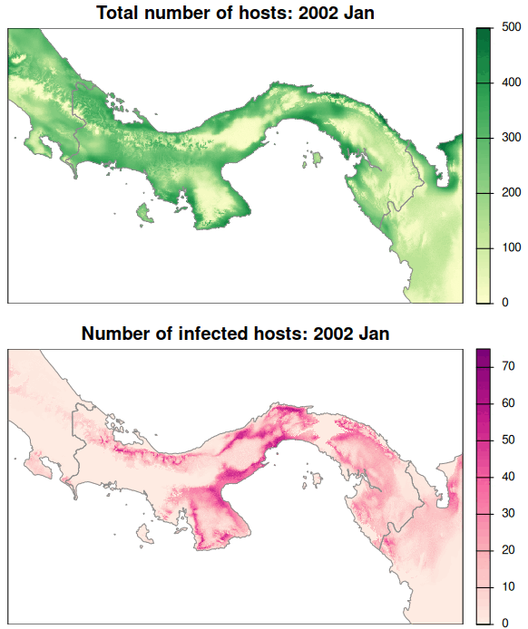

Most of my current work is focused on understanding host-pathogen interaction
dynamics across space and time. Our study focuses on Hantavirus and its host in
Panama. Thanks to the availability of data deriving from >20 years of local and 
collaborative surveillance we are able to explore this interesting phenomenon 
for the entire country and at monthly basis.
{style="text-align: justify;"}

We explore the dynamics of this interaction via metapopulation models that 
integrate time-specific ecological niche modeling, epidemiological models, 
and dispersal simulations that interact in cellular automaton. Check out a 
simple view of our initial results below.
{style="text-align: justify;"}

### Next steps

- Represent and account for variability and uncertainty in predictions.
- Test additional options in which suitability modulates parameters.
- Assess sensitivity of metapopulation models to a range of parameters in the 
epidemiological model and dispersal simulation.

 

