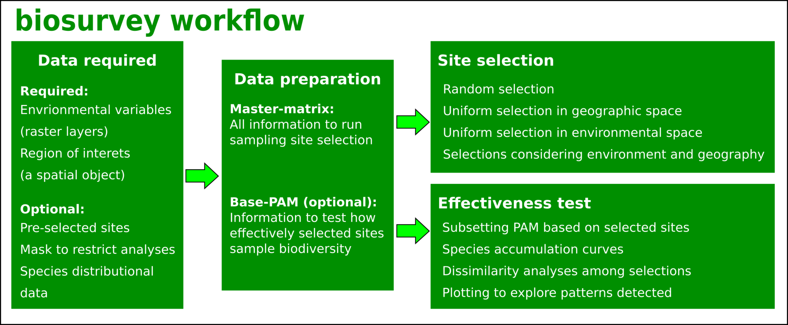

---
authors:
- Claudia Nunez-Penichet
- admin
- Jorge Soberon
- Tomer Gueta
- Narayani Barve
- Vijay Barve
- Adolfo G. Navarro-Siguenza
- A. Townsend Peterson
image: 
categories:
- Software
date: "2023-09-20T00:00:00Z"
draft: false
lastmod: "2023-09-21T00:00:00Z"
projects: []
subtitle: "An R package for ecological niche modeling using ellipsoids"
summary: "A short description of the package."
tags:
- R
- Software
- Biodiversity
- Survey
title: biosurvey
---

## What is biosurvey?

**biosurvey** R package implements multiple tools to select sampling sites for biodiversity inventory, increasing effectiveness by considering the relationship of environmental and geographic conditions in a region. The functions are grouped in three main modules: 1) Data preparation; 2) Selection of sampling sites; and, 3) Tools for testing effectiveness (Fig. 1). Data are prepared in ways that avoid the need for more data in posterior analyses and allow users to focus on critical methodological decisions to select sampling sites. Various algorithms for selecting sampling sites are available, and options for considering pre-selected sites (known to be important for biodiversity monitoring) are included. Visualization is a critical component in this set of tools and most of the results obtained can be plotted to help users to understand their implications. Methodological bases for these tools can be found in [Nuñez et al. (2022)](https://onlinelibrary.wiley.com/doi/abs/10.1111/2041-210X.13869).
{style="text-align: justify;"}

## Check the biosurvey package

If you want to try this tool you can install it on R from GitHub using `remotes::install_github("claununez/biosurvey")`. An example of its use can be found [here](https://github.com/claununez/biosurvey/tree/master#biosurvey-tools-for-biological-survey-planning).
{style="text-align: justify;"}

 