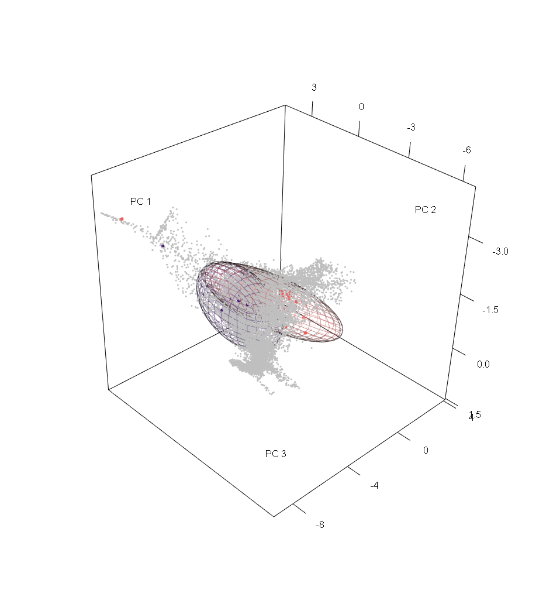

---
authors:
- admin
- Luis Osorio-Olvera
- Jorge Soberón
- Vijay Barve
- Narayani Barve
- A. Townsend Peterson
image: 
categories:
- Software
date: "2023-09-20T00:00:00Z"
draft: false
lastmod: "2023-09-21T00:00:00Z"
projects: []
subtitle: "An R pacakge for ecological niche modeling using ellipsoids"
summary: "A short description of the package."
tags:
- R
- Software
- Ellipsoids
- ENM
title: ellipsenm
---

## What is ellipsenm?

**ellipsenm** is an R package that implements multiple tools to help in using ellipsoid envelopes to model ecological niches of species. Handy options for calibrating and selecting models, producing models with replicates and projections, and assessing niche overlap are included as part of this package. Other functions implemented here are useful to perform a series of pre- and post-modeling analyses. A good reference of it use in research is [Nuñez et al. (2021)](https://escholarship.org/uc/item/4f00x5r6).
{style="text-align: justify;"}

## Check the ellipsenm package

If you want to try this tool you can install it on R from GitHub using `remotes::install_github("marlonecobos/ellipsenm")`. An example of its use can be found [here](https://github.com/marlonecobos/ellipsenm#ellipsenm-an-r-package-for-ecological-niches-characterization-usingellipsoids).
{style="text-align: justify;"}

 