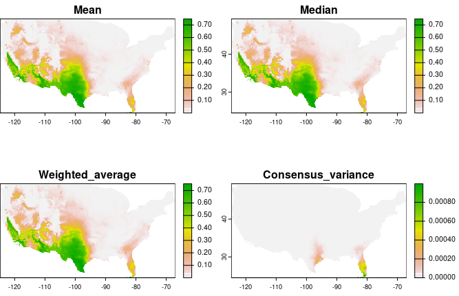

---
authors:
- Luis F. Arias-Giraldo
- admin
- A. Townsend Peterson
categories:
- Software
date: "2023-09-22T00:00:00Z"
draft: false
featured: true
image: 
lastmod: "2025-06-16T00:00:00Z"
projects: []
subtitle: "An R package for ecological niche modeling using presence-absence data"
summary: "A short description of the package."
tags:
- R
- Software
- ENM
- Presence-absence
title: enmpa
---

## What is enmpa?

**enmpa** comprises a set of tools to perform Ecological Niche Modeling using 
presence-absence data and logistic generalized linear models. Some of the main 
functions help perform data partitioning, model calibration, model selection, 
variable response exploration, and model projection. 
{style="text-align: justify;"}

 

## Check the enmpa package

If you want to try this tool you can install it on R from CRAN using 
`install.packages("enmpa")`, or from GitHub with 
`remotes::install_github("Luisagi/enmpa")`. The package and an example of its 
use can be found [here](https://github.com/Luisagi/enmpa).
{style="text-align: justify;"}

 