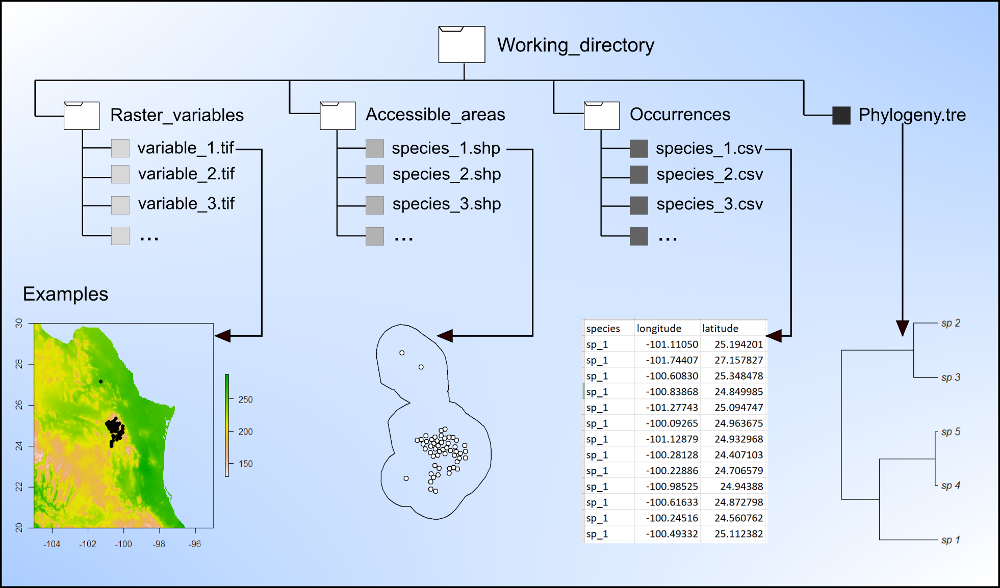

---
authors:
- admin
- Hannah L. Owens
- A. Townsend Peterson
categories:
- Software
date: "2023-09-20T00:00:00Z"
draft: false
featured: true
image:
  caption: 'Package logo'
  focal_point: ""
  placement: 2
  preview_only: false
lastmod: "2023-09-21T00:00:00Z"
projects: []
subtitle: "An R package for evolutionary reconstructions of ecological niches"
summary: "A short description of the package."
tags:
- R
- Software
- Niche evolution
- Uncertainty
title: nichevol
---

## What is nichevol?

**nichevol** is an R package that helps users to perform critical steps in the process of assessment of species’ ecological niche evolution, with uncertainty incorporated explicitly in reconstructions. The method proposed here for ancestral reconstruction of ecological niches characterizes niches using a bin-based approach that incorporates uncertainty in estimations. Compared to other existing methods, the approaches presented here reduce risks of overestimation of amounts or rates of ecological niche evolution. The main analyses include: initial exploration of environmental data in occurrence records and accessible areas, preparation of data for phylogenetic analyses, comparative phylogenetic analyses, and plotting for interpretation. These tools are based on the methods proposed by [Owens et al. (2020)](https://onlinelibrary.wiley.com/doi/full/10.1002/ece3.6359).
{style="text-align: justify;"}

## Check the mop package

If you want to try this tool you can install it on R from CRAN using `install.packages("nichevol")`. Examples of its use can be found [here](https://github.com/marlonecobos/nichevol#nichevol-tools-for-ecological-niche-evolution-assessment-consideringuncertainty) and [here](https://github.com/marlonecobos/nichevol/wiki/User-Guide).
{style="text-align: justify;"}

 